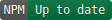
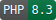

# laravel-find

Find and filter models with persistant memory of the users last used parameters.

## Installation

Add this library using `composer require anthonyedmonds/laravel-find`.

The service provider will be automatically registered.

To customise the search bar, export it using `php artisan vendor:publish --provider="AnthonyEdmonds\LaravelFind\FindServiceProvider"`

## How does this work?

LaravelFind provides a `Finder` base class which you can extend.

Fill out all of the abstract methods to provide users with a list of access filters, status filters, and sort options.

The search results and filters can then be provided to the user via the `FinderOutput` class on your blade.

The provided search bar template gives you an idea of how to present the various filters on the UI.

`Finder` writes the last used search term and filters to the session, so that the page will remain as expected between page loads.

## Upgrading from v5

Version 6+ is a fundamentally different program and should not be considered a direct upgrade.

Rather than providing a single generic search area, LaravelFind is now tailored to make searching a single model easier.

The `Finder` class provides everything needed to support a classic table of results, which will require some work on your part to implement the UI.

## Help and support

You are welcome to raise any issues or questions on GitHub.

If you wish to contribute to this library, raise an issue before submitting a forked pull request.

## Licence

Published under the MIT licence.